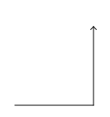

% 05: Turtles

## Turtles

- Today we will play with Turtles.
- Turtles are a visual approach to teaching programming.
- Turtles live in a sandbox.
- Turtles have a tail.
    - When the tail is down, it draws with its tail.
    - When the tail is up, it doesn't draw.
    - Turtles always start with their tail down.

## Getting Started

- Download the TurtleLogo.jar file from the GitHub course page.
- Save this file to your Desktop so that you can find it quickly.
- Create a new project in Netbeans named "TurtlePlay".
- Import the TurtleLogo.jar file.
    - Find the "Libraries" section of your project under "Projects".
    - Right click on "Libraries" and click "Add JAR/Folder..."
    - Find the TurtleLogo.jar file and open it.

## Start Programming.

Modify the line containing "public class TurtlePlay {" to look like this.

    public class TurtlePlay extends Sandbox

Our program is a sandbox in which we will add turtles. You will have to fix your code's imports to make the error on "Sandbox" go away.

## Start Programming.

In your main method, add one line of code. It will look like this.

    public static void main(String[] args) {
        launch(args);
    }

## Place a turtle 

Create a new method called "draw".

    @Override
    public void draw() {
        Turtle turtle = new Turtle();
        add(turtle);
    }

The error on "Turtle" will require you to fix your imports again. Run your program. You should see an arrow on the screen. That arrow is the turtle.

## Make the turtle move.

Move the turtle.

    @Override
    public void draw() {
        Turtle turtle = new Turtle();
        add(turtle);

        turtle.forward(100);
    }

## Line Arrow

Run your program. You should see a line with an arrow on the screen.

## Make the turtle turn and move.

Add more lines.

    turtle.left(90);
    turtle.forward(100);

## Line, Left, Line

Run your program. The turtle should have turned left and moved forward again. What do the values of 90 and 100 mean in this program?

## 90 and 100

- The "turtle.left(90)" means that the turtle will turn to the left 90 degrees. A 90 degree turn is a right-angle turn.
- The "turtle.forward(100)" means that the turtle will move forward 100 units. In this case, 1 unit is equal to 1 pixel on the monitor.

## Send the turtle back home.

Finish this code so that the turtle returns to the starting location by making a square shape. You've already completed two sides of the square.

## Here's my solution.

    Turtle turtle = new Turtle();
    add(turtle);

    turtle.forward(100);
    turtle.left();
    turtle.forward(100);
    turtle.left();
    turtle.forward(100);
    turtle.left();
    turtle.forward(100);
    turtle.left();

## Change the color.

You can change the color using the method `SetColor`. For example.

    turtle.setColor(Color.GREEN);
    turtle.forward(100);
    turtle.left();
    // ... more lines which draw

This will make the color of the square green.

## Rainbow Colors

- Any time you hit the ".", you can wait for a second an options will appear on the screen. When you type "Color." wait a bit to see all of the colors you can make.
- You can make common colors like "GREEN", "BLUE", and "RED", but you can make other colors like "WHEAT", "CADETBLUE", and "PALEGOLDENROD".
- Make each of the four lines in the square a different color.

## Up and Down

We can control the turtle's tail using the commands "turtle.up()" and "turtle.down()".

- If the tail is down, that means it is drawing.
- If the tail is up, that means it is not drawing.

## Challenge: Two squares.

Challenge: Draw a second square to the right of your first square. The second square is 50 units (or pixels) to the right of the first. There should be no lines connecting the two squares.

- Where does your first square end?
- How far will you have to move from the first square's end point to get to the second square's starting point?
- Can you somehow copy the first square to avoid retyping it?

## Problem.

- There's a problem with our code.
- We have two segments of code which do identical things.
- Programmers think this is bad and we will look more into how to fix this in future sessions.

## Fill the rest of the hour.

For both of these challenges, sketch out your plan in Microsoft Paint or draw the plan on paper.

- Challenge: Draw a house with green walls, a blue front door, and a red roof.
- Challenge: Write your name using Turtles. You will need a combination of "turtle.up()" and "turtle.down()" to do this. Make each letter in your name a different color.
