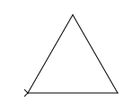
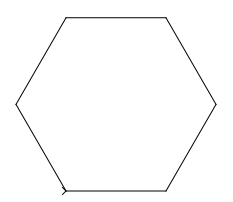
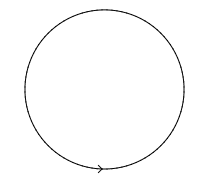

% 07: Loops

# The for Loop

## The for Loop

- The for loop allows programmers to repeat code.
- The for loop allows the programmer to initialize a control variable, test a condition, and modify the control variable all in one line of code.
- The for loop takes the form:

Code.

        for (initialization; test; update) {
            statement(s);
        }

## Example

We've drawn the square several times. It inolves this to draw the four sides.

    turtle.forward(size);
    turtle.left(90);
    turtle.forward(size);
    turtle.left(90);
    turtle.forward(size);
    turtle.left(90);
    turtle.forward(size);
    turtle.left(90);

## Using for instead.

We can reduce this to a few lines:

    for (int i = 0; i < 4; i++) {
        turtle.forward(size);
        turtle.left(90);
    }

This is less to type, but it without careful typing and understanding, there is lots to get wrong.

## The Sections of The for Loop

- The initialization section of the for loop allows the loop to initialize its own control variable.
- The test section of the for statement acts in the same manner as the condition section of a while loop.
- The update section of the for loop is the last thing to execute at the end of each loop.

## The for Loop Initialization

- The initialization section of a for loop is optional; however, it is usually provided.
- Typically, for loops initialize a counter variable that will be tested by the test section of the loop and updated by the update section.
- The initialization section can initialize multiple variables.
- Variables declared in this section have scope only for the for loop.

## The Update Expression

- The update expression is usually used to increment or decrement the counter variable(s) declared in the initialization section of the for loop.
- The update section of the loop executes last in the loop.
- The update section may update multiple variables.
- Each variable updated is executed as if it were on a line by itself.

## Modifying The Control Variable

- You should avoid updating the control variable of a for loop within the body of the loop.
- The update section should be used to update the control variable.
- Updating the control variable in the for loop body leads to hard to maintain code and difficult debugging.

## Differences between for and while

- for loops are often called "counting loops", since they are often used for counting.
- Each of the essential parts of a for loop are encouraged by Java.
    - However, they can be ignored.
- while loops are designed for processes in which we don't know how many loops are needed (for example, input validation).
- for loops are designed for processes in which we know exactly how many loops are needed.

## New Project: Shapes

- Create a new project called "Shapes".
- Import the TurtleLog.jar library.
- We will ask the user for an integer representing the number of sides of the desired shape and draw that shape.
- Because we are starting out, we will begin with a new shape: the triangle.
- A triangle has 3 sides.
- A triangle requires that we turn 120 degrees to the left each time we move.

## Just like last time.

Modify the line containing "public class Shapes {" to look like this.

    public class Shapes extends Sandbox

You will have to fix your code's imports to make the error on "Sandbox" go away.

## Start Programming.

In your main method, add one line of code. It will look like this.

    public static void main(String[] args) {
        launch(args);
    }

## Place a turtle

Create a new method called "draw".

    @Override
    public void draw() {
        Turtle turtle = new Turtle();
        add(turtle);
    }

The error on "Turtle" will require you to fix your imports again.

## Specify some variables.

Here, we will set up some variables.

    int sides = 3;
    double degrees = 120;
    double distance = 100;

We will move the turtle to create 3 sided shape, each time 100 units long and turning 120 degrees.

## Move the turtle.

    for (int i = 0; i < sides; i++) {
        turtle.forward(distance);
        turtle.left(degrees);
    }

## Results

If you run the program, a triangle should appear.

## Let's make more shapes.

- Here's a bit of geometry trivia. The sum of the internal degrees in the angles of a shape with $n$ sides is $(n-2) \times 180$.
    - A triangle has 3 sides has 180 degrees.
    - A square has 4 sides has 360 degrees.
    - A pentagon has 5 sides has 540 degrees.
    - A hexagon has 6 sides has 720 degrees.

Hopefully you see a pattern here. How many degrees will a septagon (7 sided shape) have?

## How much should you turn in order to make a particular shape?

- First, you figure out the sum of the degrees in a shape.
- Then you divide that sum by the number of sides.
    - This is your internal turn angle.
- You then turn left a number of degrees equal to 180 minus the result from the last step.
    - This is your external turn angle.

This last value, the external turn angle, is the degree that we need to turn.

## Example: Square

- A square has 4 sides, which means it has 360 degrees.
- You divide 360 by 4 to get 90.
    - This is our internal turn angle.
- You then find "180 - 90" which happens to be 90.
    - This is our external turn angle.

The external turn angle of a square is 90 degrees. We've known this already.

## Example: Triangle 

- A triangle has 3 sides, which means it has 180 degrees.
- You divide 180 by 3 to get 60.
    - This is our internal turn angle.
- You then find "180 - 60" to get 120.
    - This is our external turn angle.

The external turn angle of a triangle is 120 degrees. Let's try this.

## Ask the user for a size.

Find this line:

    int sides = 3;

Replace the line with this:

    Scanner keyboard = new Scanner(System.in);
    System.out.println("Enter sides of the shape: ");
    int sides = keyboard.nextInt();

We want the user to be able to specify the number of sides.

## But we change the sides, we must also change the degrees.

Find this line:

    double degrees = 120;

Replace it with this:

    double sumOfDegrees = (sides - 2) * 180.0;
    double internalDegrees = sumOfDegrees / sides;
    double degrees = 180 - internalDegrees;

## Run your program.

This program will work for shapes of any number of sides greater than 2. Here's a hexagon.

## Try the program with 500 sides.

- Try a big number: 500 sides!
- What happens?
- It looks like we get a curved line on the screen.

## Improving the size of the shape.

Find this line.

    double distance = 100;

Replace it with this:

    double distance = 500.0 / sides;

As long as we don't go over 500 sides, this will produce a good quality shape. Try the program again with a size of 500. Now we have a shape which draws with the correct number of sides and dynamically resizes itself.

## What shape is this?

This shape has 500 sides. What does it look like?

## Circles

- A 500-sided shape is approximately a circle. Visually, they have no difference.
- Most video games will draw circles using lots of straight lines because it is faster than true circles.

## Add to the code.

Add to the code a couple of `if` statements.

- If the number of sides is less than 3, make the program always display a triangle.
- If the number of sides is greater than 500, make the program always display a 500-sided shape.
