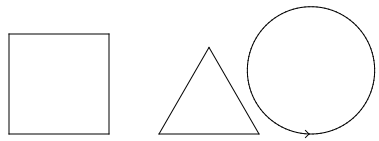

% 09: Methods

# Draw some basic shapes.

## New Project: ModernArt

- Create a new project called "ModernArt".
- Import the TurtleLog.jar library.
- In this project, we will do basic shapes, like yeterday, but with a new twist.

## Just like last time.

Modify the line containing "public class ModernArt {" to look like this.

    public class ModernArt extends Sandbox

You will have to fix your code's imports to make the error on "Sandbox" go away.

## Start Programming.

In your main method, add one line of code. It will look like this.

    public static void main(String[] args) {
        launch(args);
    }

## Place a turtle

Create a new method called "draw".

    @Override
    public void draw() {
        Turtle turtle = new Turtle();
        add(turtle);
    }

You will need to fix imports.

## Draw a square.

- Wait a second.
- Haven't we already done a square?
- Yes, we have. Please draw a square.
- Make each side length 100 units.
- You don't get the code for this. We'll wait.

## Next: Draw a Triangle.

- I'm pretty sure we've done triangles too.
- A triangle is three sides and we turn 120 degrees to the left after each side is drawn.
- Make each side length 100 units.
- Make sure that the triangle is some space away from the square.

## Next: Draw a circle.

- Oh! I remember how to do circles. I think that requires a loop.
- A circle requires that we move 5 forward units and then turn 3.6 to the left. We do this 100 times.
- Make sure that the circle is some space away from the square and the triangle.
- If you need help with a for-loop, ask. Maybe someone will write this on the board.

## You've done this before.

# Refactoring

## Refactoring

- Refactoring is what we do with code when it becomes extremely long and hard to understand.
- Look back through your code.
    - Where does the square begin and end?
    - Where does the triangle begin and end?
    - Where does the circle begin and end?
- I promise: If you had not written this code, you wouldn't be able to tell.
- Look at someone else's code and answer their questions. See if someone can answer these questions about your code.
- Writing code is hard. Reading code is often equally hard.

## Return to your code 

- Find the code where you drew the square. Only the square. Highlight those lines of code (usually 8).
- Right click and find the menu option for "Refactor".
- Find "Introduce".
- Find and click on the menu for "Method..."
- (You can also tap "Alt+Shift+M" on the keyboard.
- Name this method "drawSquare".

## Run your program again.

## Nothing changed!

- Exactly!
- Nothing should change when you refactor your code except that there's a new line in your code that only says "drawSquare(turtle);"

## Find `drawSquare`

My method looks like this. Don't type this.

    private void drawSquare(Turtle turtle) {
        turtle.forward(100);
        turtle.left(90);
        turtle.forward(100);
        turtle.left(90);
        turtle.forward(100);
        turtle.left(90);
        turtle.forward(100);
        turtle.left(90);
    }

## Again: Triangle

- Find the code where you drew the triangle. Only the triangle. Highlight those lines of code.
- Right click and find the menu option for "Refactor".
- Find "Introduce".
- Find and click on the menu for "Method..."
- (You can also tap "Alt+Shift+M" on the keyboard.)
- Name this method "drawTriangle".

## Again: Circle

- Find the code where you drew the circle. Only the circle. Highlight those lines of code.
- Right click and find the menu option for "Refactor".
- Find "Introduce".
- Find and click on the menu for "Method..."
- (You can also tap "Alt+Shift+M" on the keyboard.)
- Name this method "drawCircle".

## Again: Circle

- Find the code where you move the turtle from one shape to the next.
- Right click and find the menu option for "Refactor".
- Find "Introduce".
- Find and click on the menu for "Method..."
- (You can also tap "Alt+Shift+M" on the keyboard.)
- Name this method "moveToNextShape".

## When you are done.

This was my code to direct the turtle to draw all three shapes and move between each shape. This code is far easier to read, yet it does the same thing.

    drawSquare(turtle);
    moveToNextShape(turtle);
    drawTriangle(turtle);
    moveToNextShape(turtle);
    drawCircle(turtle);

# Why Methods?

## Why Write Methods?

- Methods are blocks of code that are called as needed. Don't need it? Okay. Don't call it.
- Methods are commonly used to break a problem down into small manageable pieces.
- Methods simplify programs. If a specific task is performed in several places in the program, a method can be written once to perform that task, and then be executed anytime it is needed.  This is known as code reuse.
- You've been creating and using methods every day of this camp.
- The refactoring tool will allow you to create more methods.

## Parts of a method.

Study this code. The first line is most important.

    private void drawCircle(Turtle turtle) {
        for (int i = 0; i < 100; i++) {
            turtle.forward(4);
            turtle.left(3.6);
        }
    }

## Parts of a method.

- private: This says that a method can only be called by other methods in this file. The opposite of private is public, which means any method can call this method.
- void: This is the return type. The return type lets you know what kind of data is given back after calling this method. Specifically, the word "void" means that a method doesn't return anything.
- drawCircle: This is the name of the method.
- (Turtle turtle): These are the parameters. If there are no parameters, you'll see "()". This method has one parameter: it's type is "Turtle" and the parameters name is "turtle". We typically make types begin with an uppercase letter and variables begin with a lowercase letter.
- The rest of the method is the code.

## Modify your code

Find your `draw` method and change the code to this:

    drawCircle(turtle);
    moveToNextShape(turtle);
    drawCircle(turtle);
    moveToNextShape(turtle);
    drawCircle(turtle);

You should see three circles on the screen.

## Activity

Make a few changes to `drawCircle`. Here, we added a second parameter and changed the call to "turtle.forward()".

    private void drawCircle(Turtle turtle, double size) {
        for (int i = 0; i < 100; i++) {
            turtle.forward(size);
            turtle.left(3.6);
        }
    }

## Change 2

You will need to add a second parameter to each of your calls to `drawCircle` in the `draw` method:

    drawCircle(turtle, 3);
    moveToNextShape(turtle);
    drawCircle(turtle, 5);
    moveToNextShape(turtle);
    drawCircle(turtle, 4);

The first circle is the smallest, then the third, then the second.

## Fill the rest of the hour

- Add size parameters to each of the other methods which draw polygons.
