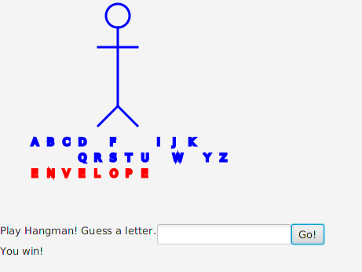
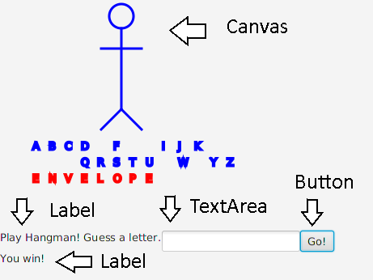

% 12: GUIs

# GUI Applications

## What is a GUI?

- GUI (pronounced "gooey") stands for graphical user interface.
- It's what we call desktop applications that mostly use a **mouse**.
- The library for building GUI applications in Java is called **JavaFX**.

## Quiz.

- What does GUI stand for?
- What piece of computer hardware is used with a GUI?
- What is the library in Java which allows us to make GUI applications?

# Hangman

## Hangman

- Today we will be writing a Hangman game from scratch in Java.
- In Hangman, the program maintains a secret word.
- You get 5 wrong guess to select all of the letters in the secret word.
- If you finish the word without losing all of your wrong guesses, you win.
- If you guess wrong 5 times, you lose.

## Let's get started.

- Make a new project called "Hangman".
- JavaFX is already installed on everyone's computers, so there are no special libraries to install. Yay!
- Since this a complicated game, we are going to be writing some object oriented programming.
- Java programmers frequently bounce between files to get code written.

## Hangman

## Extend as an Application.

We've got to do some setup first. Find the line that looks like this:

    public class Hangman {

Change it to this:

    public class Hangman extends Application {

## Modify Main

Add this line to `main`. We had to do this for our Turtles.

    public static void main(String[] args) {
        launch(args);
    }

## Errors.

- There is still an error in the code. JavaFX requires a method to work, but NetBeans will introduce it for us.
- The word "Hangman" will have a red squiggly line under it.
- Click the word with your mouse once so that the cursor is in the word.
- Hit "ALT+Enter" on the keyboard.
- Select the first option "Implement all abstract methods."

## Modify the method.

- You should find a new method in your code. NetBeans added this for us.
- In the method, you'll find this line.

Code.

    throw new UnsupportedOperationException("...");

Remove this line. NetBeans wants you to remove it.

## Let's identify the parts of our game.

There are 5 core parts of our interface. One of these, the Canvas, will be a challenge to write. We will focus on it first.

## Make a new class: HangmanGame

- Make a new class called "HangmanGame".
- Right click on the "hangman" package and select "New...", then "Java Class...".
- Name this "HangmanGame". Make sure that it is in the "hangman" package.
- Your new file should have "package hangman;" at the top. If it doesn't, delete the file and try again.

## HangmanGame: Add some variables.

These are all variables which our canvas will manage. There's lots going on in Hangman.

    public class HangmanGame {

        private Canvas canvas;
        private char[] letters;
        private char[] revealed;
        private int blanks;
        private int lives;
        private String word;

## Part 1: Add the Consturctor

The Constructor is a special method used to initialize variables.

    public HangmanGame(double width, double height) {
        super(width, height);
        
        letters = new char[] {'A','B','C','D','E','F','G','H',
                              'I','J','K','L','M','N','O','P',
                              'Q','R','S','T','U','V','W','X',
                              'Y','Z'};

We are going to test those typing fingers!

## Part 2: Add the Consturctor

Here, we can set our game's secret word. I picked "ENVELOPE".

        lives = 5;
        word = "ENVELOPE";
        revealed = new char[word.length()];
        blanks = word.length();
        canvas = new Canvas(width, height);
    }

## HangmanGame. Add these two methdods.

The first method tells us if we lost. The second tells us if we won.

    public boolean lost() {
        return lives == 0;
    }
    
    public boolean won() {
        return blanks == 0;
    }

## HangmanGame: getCanvas

    public Canvas getCanvas() {
        return canvas;
    }

So much of object oriented programming is getting objects to communicate with each other since they don't easily share information. We often have to write short methods like this.

## HangmanGame: draw method.

Add a method to draw on the canvas. So far, we have nothing to draw, but we will need this later.

    public void draw() {
    }

## Return to Hangman.java

We finally have enough to start writing our GUI. Return to the `start` method in `Hangman.java`. Here are the five components to our window.

        Label gameState = new Label("");
        Label playHangman = new Label("Play Hangman! Guess a letter.");
        TextField field = new TextField();
        Button button = new Button("Go!");
        HangmanGame game = new HangmanGame(300, 300);

        HBox hPane = new HBox();
        hPane.getChildren().addAll(playHangman, field, button);
        
        VBox vPane = new VBox();
        vPane.getChildren().addAll(game.getCanvas(), hPane, gameState);
        
        game.draw();
        
        button.setOnAction(event -> {
              char guess = field.getText().toUpperCase().charAt(0);
              field.setText("");
              game.scratch(guess);
              game.draw();
              
              if (game.won()) {
                  gameState.setText("You win!");
              }
              
              if (game.lost()) {
                  gameState.setText("You lost!");
              }
           });
        
        primaryStage.setScene(new Scene(vPane));
        primaryStage.show();
