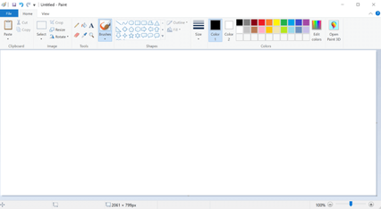
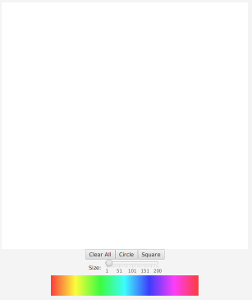

% 14: Paint Application

# Event Driven Programming

## What goes on in Paint?

- You click on a color.
- You click on a brush size.
- You drag your mouse around a canvas.
- You use tools on the toolbar to do a number of other tasks.
- In short, there's lots of clicking.
- Each click should trigger an **event**.
- This is known as **event driven programming**.

## MS Paint.

## Our Paint

## Event Driven Programming

- Event Driven Programming can be a challenge.
- When someone clicks on a color, the program must remember the last color clicked.
- When someone selects the size of the brush, the program must remember the last brush size.
- These aren't freebies: Someone had to write the code to do all of this remembering.

## Our Paint Application

We have several goals for our paint application:

- Have a choice of brush shape: circle or square.
- Have a choice of brush size: 1 to 200 pixels.
- Have a choice of color: We will have 360 color options.
- Have a clear button.

All of these choices will require lots of clicks and lots of clicks require lots of programming.

# Programming Paint

## Let's get started.

- Make a new project called "PaintApp".

## Extend as an Application.

We've got to do some setup first. Find the line that looks like this:

    public class PaintApp {

Change it to this:

    public class PaintApp extends Application {

## Modify Main

Add this line to `main`.

    public static void main(String[] args) {
        launch(args);
    }

## Errors.

- There is still an error in the code. JavaFX requires a method to work, but NetBeans will introduce it for us.
- The word "PaintApp" will have a red squiggly line under it.
- Click the word with your mouse once so that the cursor is in the word.
- Hit "ALT+Enter" on the keyboard.
- Select the first option "Implement all abstract methods."

## Modify the method.

- You should find a new method in your code. NetBeans added this for us.
- In the method, you'll find this line.

Code.

    throw new UnsupportedOperationException("...");

Remove this line. NetBeans wants you to remove it. Your program will crash if you keep it. Leave `start` for now.

## Add some member variables

We need a few member variables to our class. This is immediately after the class declaration line.

    public class PaintApp extends Application {

        public double size;
        public int shape;

Here, `size` is the size of the brush. `shape` is which shape to draw. 0 is circle. 1 is square. I made these numbers up. Each shape should have a different number.

# The draw method

## Add a "draw" method.

The draw method is responsible for drawing either a circle (0) or a square (1).

    private void draw(MouseEvent event, GraphicsContext gc) {
        double x = event.getX();
        double y = event.getY();
        double half = size / 2;
        
        if (shape == 0)
            gc.fillOval(x-half, y-half, size, size);
        
        if (shape == 1)
            gc.fillRect(x-half, y-half, size, size);
    }

# The start method

## The start method.

The start method will contain ...

- The full code for the look of our Paint application.
- All of the event handler code.
    - In the hangman game, there was 1 event handler.
    - In this program, there are 9 event handlers.
- There are two methods in this entire program: draw and start.

## Part 1. Return to `start`.

Currently our `start` is empty. Let's add some code. These variables control the brush size, brush shape, width, and height of the window.

        size = 10;
        shape = 0;
        int width = 600;
        int height = 600;

## Part 2. Make the widgets.

The elements on a GUI screen are called **widgets**. We have several widgets in our code. Here's the canvas for drawing, the size label, and the color selection canvas.

        Canvas canvas = new Canvas(width, height);
        Label sizeLabel = new Label("Size: ");
        Canvas colors = new Canvas(360, 50);
        
## Part 3. Slider widget.

The slider widget will control our brush size. The "1" represents the smallest brush size. "200" means the largest. "10" represents the starting position of the slider. We also turn on tick marks and labels on the slider.

        Slider slider = new Slider(1, 200, 10);
        slider.setShowTickMarks(true);
        slider.setShowTickLabels(true);

## Part 4. The Buttons

We have three buttons in our program: Circle, Square, and a Clear All button.

        Button circle = new Button("Circle");
        Button square = new Button("Square");
        Button clear = new Button("Clear All");

## Part 5: The button horizontal pane

The horizontal pane for our buttons will be called **buttons**. It contains all three buttons. We center this pain.
        
        HBox buttons = new HBox();
        buttons.getChildren().addAll(clear, circle, square);
        buttons.setAlignment(Pos.CENTER);

## Part 6: The slider horizontal pane

We also use a horizontal pane for the slider because we need to pack the label and the slider on the same line. We also center this pane.
        
        HBox sliderPane = new HBox();
        sliderPane.getChildren().addAll(sizeLabel, slider);
        sliderPane.setAlignment(Pos.CENTER);

## Part 7: The vertical pane

The vertical pane coordinates everything, including all of the horizontal panes. We center this pane.

        VBox vPane = new VBox();
        vPane.getChildren().addAll(canvas,
                                   buttons,
                                   sliderPane,
                                   colors);
        vPane.setAlignment(Pos.CENTER);

## Part 8: Create the scene

This is standard code for creating a scene. We pack the scene onto a stage and then show the stage.

        Scene scene = new Scene(vPane);
        primaryStage.setScene(scene);
        primaryStage.show();

## Pause for station identification

- Now would be a good time to test the application.
- Maybe even take a break.

## Part 9: Initialize the Paint area

We have to initialize something called a "graphics context" for our two canvases.  We also paint the drawing canvas white and set the cursor to blue.
        
        GraphicsContext colorC =
            colors.getGraphicsContext2D();
        GraphicsContext canvasC =
            canvas.getGraphicsContext2D();
        canvasC.setFill(Color.WHITE);
        canvasC.fillRect(0, 0, width, height);
        canvasC.setFill(Color.BLUE);

## Part 10: Create the Colors on the Color Canvas

This will draw 360 one-pixel wide lines on the screen, each of which are a slightly different color. The effect is a rainbow pattern on the screen which we can use to select colors.

        for (int i = 0; i < 360; i++) {
            Color c = Color.hsb(i, 1, 1);
            colorC.setStroke(c);
            colorC.strokeLine(i, 0, i, 49);
        }

## Part 11: Write the event handler for the Color Canvas

Here, we write our first event handler: a mouse click event for when someone clicks on the color canvas. It gets the x-coordinate of the click and sets the fill color.
        
        colors.setOnMouseClicked(event -> {
            double x = event.getX();
            Color c = Color.hsb(x, 1, 1);
            canvasC.setFill(c);
        });

## Part 12:  Write the event handler for the Drawing Canvas

There are two types of clicks on the drawing canvas: clicking and dragging. Each need their own event handler. Thankfully, we can use the same method for each. It's the `draw` method that we wrote earlier.

        canvas.setOnMouseDragged(event -> {
            draw(event, canvasC);
        });
        
        canvas.setOnMouseClicked(event -> {
            draw(event, canvasC);
        });

## Part 13: Write the event handler for the slider

Likewise, there are two ways of interacting with slider: clicking and dragging. Each needs their own event handler. Thankfully, this code is exactly 1 line long for each.
        
        slider.setOnMouseClicked(event -> {
            size = slider.getValue();
        });
        
        slider.setOnMouseDragged(event -> {
            size = slider.getValue();
        });

## Part 14: Write the event handler for the shape buttons

We need to set the shape when someone clicks on `circle` or `square`. Remember: 0 is for circle and 1 is for square.
        
        circle.setOnAction(event -> {shape = 0;});
        square.setOnAction(event -> {shape = 1;});

## Part 15: Write the event handler for the clear button

Finally, we need the code to clear the canvas. We clear with a white color, but we also need to temporarily save the current color while filling the screen. Afterward, we set the fill again.
        
        clear.setOnAction(event -> {
            Paint c = canvasC.getFill();
            canvasC.setFill(Color.WHITE);
            canvasC.fillRect(0, 0, width, height);
            canvasC.setFill(c);
        });
    }

That last "}" is the end of the `start` method.

## Conclusion

- We wrote lots of events in this code.
- Each event needs to pay special attention to how that event will impact other events.
- Thankfully (and by design) none of the events in this program conflict with the other events. You can click anything in any order!

## How might we add new features?

- Discuss new features we can add.
- What colors can we not select?
- How might we add those colors?
